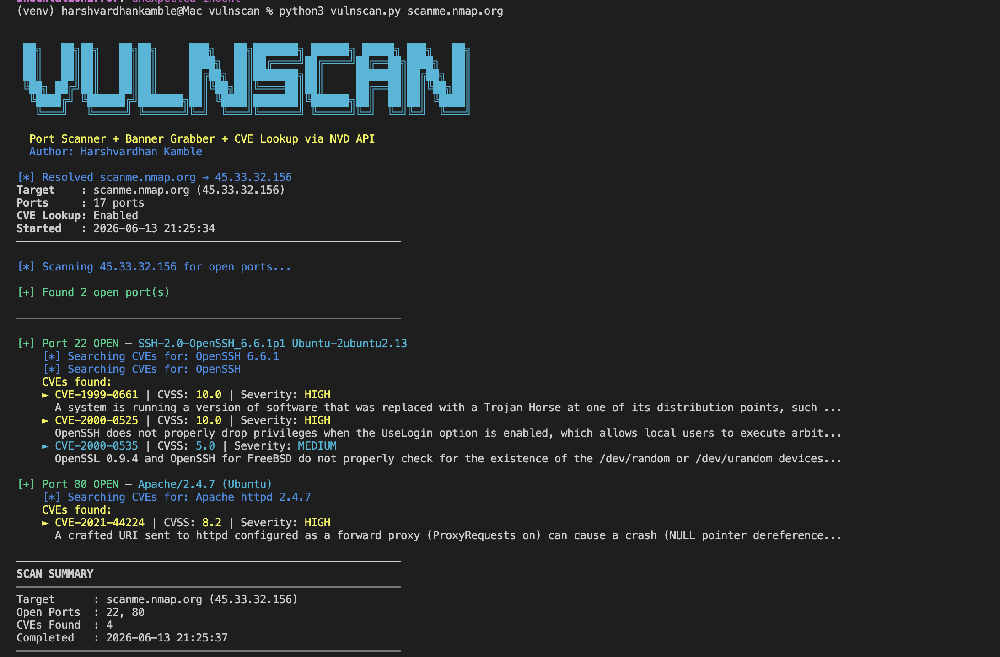

# 🔍 vulnscan — Python Vulnerability Scanner

A lightweight command-line vulnerability scanner built from scratch in Python. Performs port scanning, service banner grabbing, and CVE lookup via the NVD API.

---

## 📋 Overview

vulnscan simulates what real vulnerability scanners do under the hood — connect to open ports, identify running services, and cross-reference them against the National Vulnerability Database to find known CVEs.

**Built to demonstrate:** Python scripting, networking fundamentals, CVE/CVSS knowledge, and API integration.

---

## ✨ Features

- **Port Scanner** — Multi-threaded TCP port scanning using Python sockets
- **Banner Grabbing** — Connects to open ports and reads service banners to identify software and version
- **CVE Lookup** — Queries the NVD API for known vulnerabilities matching detected services
- **Smart Fallback Search** — If a specific version returns no CVEs, automatically retries with just the product name
- **CVSS Severity Coloring** — Color-coded output based on CVSS score (Critical/High/Medium/Low)
- **Concurrent Scanning** — Uses ThreadPoolExecutor for fast multi-port scanning

---

## 🖥️ Example Output

```
[*] Resolved scanme.nmap.org → 45.33.32.156
Target    : scanme.nmap.org (45.33.32.156)
Ports     : 17 ports
CVE Lookup: Enabled
Started   : 2026-06-13 21:13:55
────────────────────────────────────────────────────────────

[+] Port 22 OPEN — SSH-2.0-OpenSSH_6.6.1p1 Ubuntu-2ubuntu2.13
    [*] Searching CVEs for: OpenSSH 6.6.1
    [*] Searching CVEs for: OpenSSH
    CVEs found:
    ► CVE-2000-0525 | CVSS: 10.0 | Severity: HIGH
      OpenSSH does not properly drop privileges when the UseLogin option is enabled...
    ► CVE-2000-0535 | CVSS: 5.0 | Severity: MEDIUM
      OpenSSL 0.9.4 and OpenSSH for FreeBSD do not properly check for /dev/random...

[+] Port 80 OPEN — Apache/2.4.7 (Ubuntu)
    [*] Searching CVEs for: Apache httpd 2.4.7
    CVEs found:
    ► CVE-2021-44224 | CVSS: 8.2 | Severity: HIGH
      A crafted URI sent to httpd configured as a forward proxy can cause a crash...

────────────────────────────────────────────────────────────
SCAN SUMMARY
────────────────────────────────────────────────────────────
Target      : scanme.nmap.org (45.33.32.156)
Open Ports  : 22, 80
CVEs Found  : 4
Completed   : 2026-06-13 21:13:59
────────────────────────────────────────────────────────────
```

---

## 🚀 Installation

```bash
# Clone the repo
git clone https://github.com/harshh211/vulnscan.git
cd vulnscan

# Create virtual environment
python3 -m venv venv
source venv/bin/activate  # On Windows: venv\Scripts\activate

# Install dependencies
'pip install -r requirements.txt'
```

---

## ⚙️ Configuration

**Get a free NVD API key** (recommended):
1. Go to https://nvd.nist.gov/developers/request-an-api-key
2. Enter your email — key arrives instantly
3. Open `vulnscan.py` and replace:

```python
NVD_API_KEY = "YOUR_NVD_API_KEY_HERE"
```

With your actual key. Without a key the scanner still works but has lower rate limits.

---

## 📖 Usage

```bash
# Scan default ports (17 common ports)
python3 vulnscan.py scanme.nmap.org

# Scan specific ports
python3 vulnscan.py 192.168.1.1 -p 22,80,443

# Scan a port range
python3 vulnscan.py scanme.nmap.org -p 1-1000

# Skip CVE lookup (faster)
python3 vulnscan.py 192.168.1.1 --no-cve

# Scan by IP
python3 vulnscan.py 45.33.32.156
```

---

## 🛠️ How It Works

### 1. Port Scanning
Uses Python's `socket` module with `connect_ex()` to probe each port. Multi-threaded with `ThreadPoolExecutor` for speed — scans 50 ports simultaneously.

### 2. Banner Grabbing
For each open port, connects and sends a probe:
- HTTP ports (80, 443, 8080) → sends `HEAD / HTTP/1.0` request, parses `Server:` header
- Other ports → sends `\r\n` and reads response

Extracts service name and version from the response (e.g. `Apache/2.4.7`, `OpenSSH_6.6.1`).

### 3. CVE Lookup
Parses the banner to extract a clean search term:
- `SSH-2.0-OpenSSH_6.6.1p1` → searches `OpenSSH 6.6.1`
- `Apache/2.4.7 (Ubuntu)` → searches `Apache httpd 2.4.7`

Queries the NVD API and extracts CVE ID, CVSS score, severity, and description. If specific version returns no results, falls back to product name only.

### 4. CVSS Severity Colors
| Score | Severity | Color |
|-------|----------|-------|
| 9.0 - 10.0 | Critical | 🔴 Red |
| 7.0 - 8.9 | High | 🟡 Yellow |
| 4.0 - 6.9 | Medium | 🔵 Cyan |
| 0.1 - 3.9 | Low | 🟢 Green |

---

## 📦 Default Ports Scanned

```
21 (FTP), 22 (SSH), 23 (Telnet), 25 (SMTP), 53 (DNS),
80 (HTTP), 110 (POP3), 135 (RPC), 139 (NetBIOS), 143 (IMAP),
443 (HTTPS), 445 (SMB), 3306 (MySQL), 3389 (RDP),
5900 (VNC), 8080 (HTTP-Alt), 8443 (HTTPS-Alt)
```

---

## 📁 Project Structure

```
vulnscan/
├── vulnscan.py      # Main scanner
├── requirements.txt
└── README.md
```

---

## ⚠️ Disclaimer

This tool is intended for **educational purposes and authorized testing only**. Only scan systems you own or have explicit permission to test. Unauthorized port scanning may be illegal in your jurisdiction.

---

## 👤 Author

**Harshvardhan Kamble**  
Georgia State University 
June 2026
